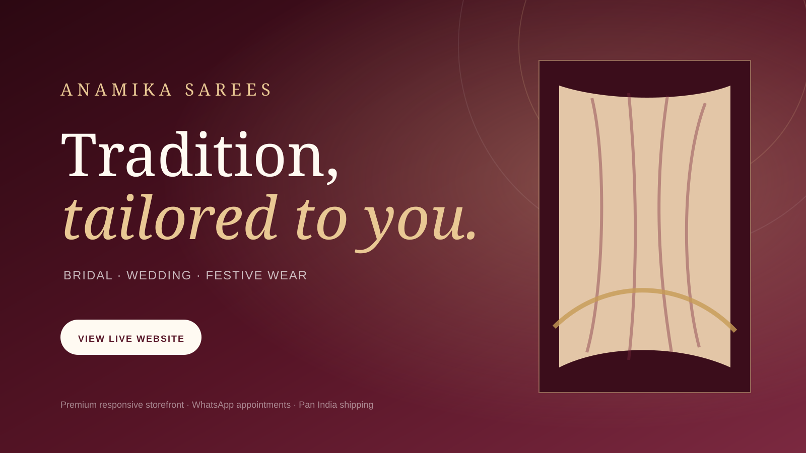

<div align="center">



<br />

# Anamika Sarees — Premium Fashion Website

A luxury, editorial-style and fully responsive storefront created for **Anamika Sarees, Indore**. The experience highlights bridal sarees, wedding wear, festive collections and designer lehengas with smooth interactions and direct WhatsApp enquiries.

<br />

<a href="https://satitech-official.github.io/anamika-sarees-website/">
  
</a>
&nbsp;
<a href="https://wa.me/919111985445">
  
</a>

</div>

---

## About the Project

The website repositions Anamika Sarees as a refined fashion destination rather than a conventional catalogue. It uses a wine, ivory and antique-gold visual system, large editorial typography and carefully structured content to create a premium shopping journey across mobile, tablet and desktop screens.

## Key Features

- Luxury editorial hero section and premium collection layouts
- Fully responsive design for mobile, tablet, laptop and desktop
- Filterable Bridal, Silk, Festive and Lehenga collections
- Direct product enquiries through WhatsApp
- Functional personal appointment form with validation
- Store address, calling, Instagram and Google Maps integration
- Smooth reveal animations, testimonial slider and mobile navigation
- Accessibility-friendly semantic HTML and reduced-motion support
- SEO metadata, Open Graph information and custom favicon
- Automated GitHub Pages deployment

## Business Details

**Anamika Sarees**  
Bridal · Wedding · Festive Wear  
16/1, Sitlamata Bazar Main Road, Indore  
Call / WhatsApp: **+91 91119 85445**  
Instagram: **@anamika__sarees**  
Pan India Shipping Available

## Technology

`HTML5` · `CSS3` · `JavaScript` · `GitHub Pages` · `GitHub Actions`

## Project Structure

```text
anamika-sarees-website/
├── .github/workflows/deploy.yml
├── assets/
│   ├── favicon.svg
│   └── readme-cover.svg
├── index.html
├── styles.css
├── script.js
└── README.md
```

## Run Locally

```bash
git clone https://github.com/satitech-official/anamika-sarees-website.git
cd anamika-sarees-website
python -m http.server 8000
```

Then open `http://localhost:8000` in your browser.

---

<div align="center">
  <p>Designed and developed by <strong>SATI Technologies</strong></p>
</div>
