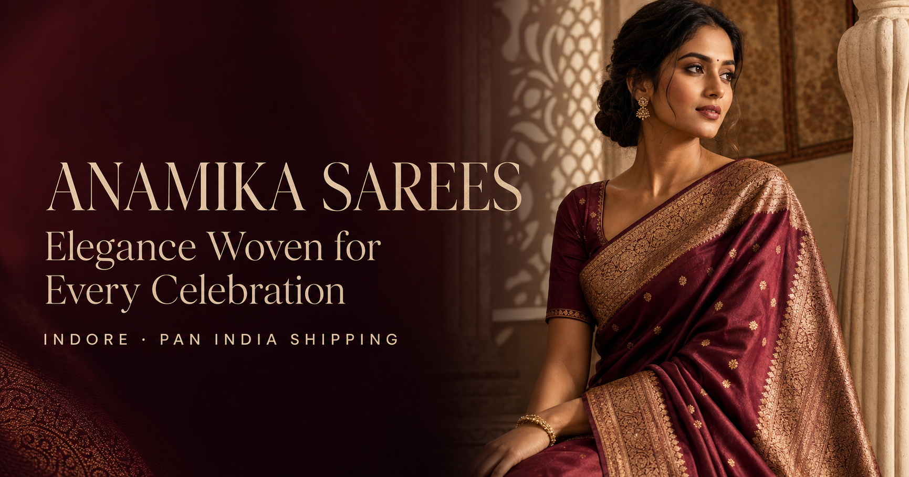

# Anamika Sarees — Premium Ethnic Fashion Website

<p align="center">
  <a href="https://anamika-sarees-indore.nikhilbaraskar551.chatgpt.site">
    
  </a>
</p>

<p align="center">
  <a href="https://anamika-sarees-indore.nikhilbaraskar551.chatgpt.site">
    
  </a>
</p>

An elegant, responsive storefront for **Anamika Sarees, Indore**, featuring bridal sarees, designer sarees, festive collections and bridal lehengas.

## Live Website

### [Open Anamika Sarees →](https://anamika-sarees-indore.nikhilbaraskar551.chatgpt.site)

GitHub repository: [satitech-official/anamika-sarees-website](https://github.com/satitech-official/anamika-sarees-website)

## Highlights

- Premium animated hero and bridal collection showcase
- Real saree and lehenga catalogue photography
- Functional product search with instant results
- Wishlist and WhatsApp enquiry experience
- Bridal lehenga carousel and product quick view
- Google Maps, contact form and click-to-call integration
- Fully responsive mobile and desktop layouts
- Smooth loader, marquees, transitions and back-to-top control

## Local Development

Requirements: Node.js `22.13.0` or newer.

```bash
npm install
npm run dev
```

Production check:

```bash
npm run build
```

## Technology

- React 19
- Next.js / Vinext
- TypeScript
- Tailwind CSS
- Lucide and React Icons

---

Built for **Anamika Sarees · Indore**

